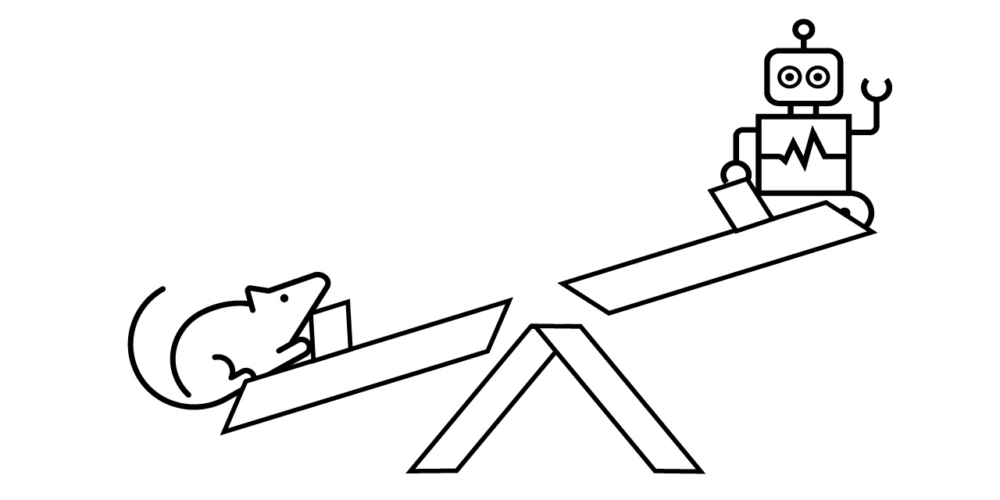
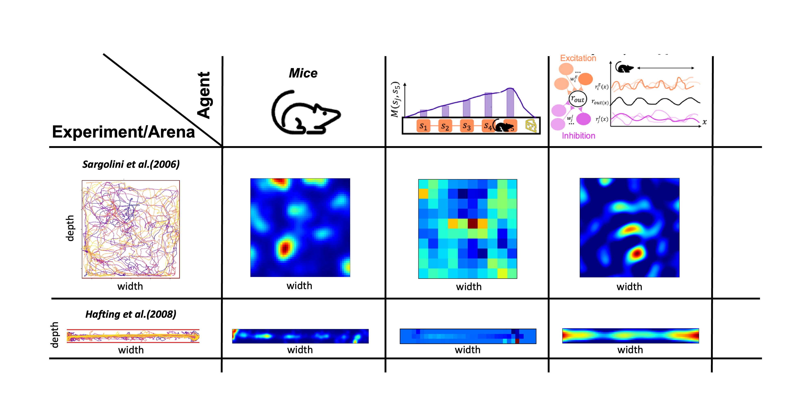

[](https://opensource.org/licenses/MIT)

[](https://codecov.io/gh/SainsburyWellcomeCentre/NeuralPlayground)
[](https://github.com/charliermarsh/ruff)
[](https://github.com/python/black)
[](https://github.com/pre-commit/pre-commit)
<!-- ALL-CONTRIBUTORS-BADGE:START - Do not remove or modify this section -->
[](#contributors)
<!-- ALL-CONTRIBUTORS-BADGE:END -->

# NeuralPlayground 
## *A standardised environment for the hippocampus and entorhinal cortex models.* <a href="https://githubtocolab.com/SainsburyWellcomeCentre/NeuralPlayground/blob/main/examples/colab_example.ipynb" target="_parent"></a>



<!-- TOC -->
- [Introduction](#introduction)
- [Installation](#installation)
  - [Create a conda environment](#create-a-conda-environment)
  - [Pip install](#pip-install)
  - [Install for development](#install-for-development)
- [Usage](#usage)
  - [Agent Arena interaction](#agent-arena-interaction)
  - [Simulation Manager](#simulation-manager)
- [I want to contribute](#i-want-to-contribute)
- [Cite](#cite)
- [License](#license)
- [Contributors](#contributors)
<!-- /TOC -->

## Introduction
The abstract representation of space has been extensively studied in the hippocampus and entorhinal cortex. 
A growing variety of theoretical models have been proposed
to capture the rich neural and behavioral phenomena associated with these circuits. However, objective comparison 
of these theories against each other and against empirical data is challenging.

Although the significance of virtuous interaction between experiments and theory is widely recognized, the tools 
available to facilitate comparison are limited. Some important challenge we aim to solve are:

   1. Lack availability and accessibility of data in a standardized, labeled format.

   2. Standard and easy ways to compare model output with empirical data.

   3. A repository of models and data sets that are relevant for the field of hippocampus and entorhinal cortex.

To address this gap, we present an open-source standardised software framework - NeuralPlayground - to enable 
comparison between the hippocampus and entorhinal cortex models. This Python software package offers a reproducible 
way to compare models against a centralised library of published experimental results, including neural recordings 
and animal behavior. The framework currently contains implementations of three Agents, as well as three Experiments 
providing simple interfaces to publicly available neural and behavioral data. It also contains a customizable 
2-dimensional Arena (continuous and discrete) able to produce common experimental environments in which the agents can 
move in and interact with. Each module can also be used separately, allowing flexible access to influential
models and data sets.

We currently rely on visual comparison of a hand-selected number of outputs of the model with neural recordings as 
shown in [github.com/NeuralPlayground/examples/comparison](https://github.com/SainsburyWellcomeCentre/NeuralPlayground/blob/main/examples/comparisons_examples/comparison_from_manager.ipynb). 
In the future, a set of quantitative and 
qualitative measures will be added for systematic comparisons across Agents, Arenas, and Experiments. 
We want to restate that this won't constitute a definitive judgment on the ability of an Agent to replicate the brain 
mechanism. Instead, this allows an objective and complete comparison to the current evidence in the field, as is 
typically done in publications, which can be used to guide model design and development.

Altogether, we hope our framework, offers
a foundation that the community will build upon, working toward a shared, standardized, open, and
reproducible computational understanding of the hippocampus and entorhinal cortex.

Try our short tutorial online in Colab. <a href="https://githubtocolab.com/SainsburyWellcomeCentre/NeuralPlayground/blob/main/examples/colab_example.ipynb" target="_parent"></a>

## Installation

### Create a conda environment
We advise you to install the package in a virtual environment,
to avoid conflicts with other packages. For example, using `conda`:

```python
conda create --name NPG-env python=3.10
conda activate NPG-env
conda install pip
```

### Pip install

You can use `pip` get the latest release of NeuralPlayground from PyPI.
```python
# install the latest release
pip install NeuralPlayground

# upgrade to the latest release
pip install -U NeuralPlayground

# install a particular release
pip install NeuralPlayground==0.0.5
```
> **Note**
> 
> If you wish to run our implementation of the Tolman-Eichenbaum machine, there are additional dependencies to install. These can be found in the [TEM_README.md](examples/agent_examples/TEM_README.md) file.

### Install for development

If you want to contribute to the project, get the latest development version
from GitHub, and install it in editable mode, including the "dev" dependencies:

```bash
git clone https://github.com/SainsburyWellcomeCentre/NeuralPlayground/ --single-branch
cd NeuralPlayground
pip install -e .[dev]
```
> **Note**
> 
> if you are using the `zsh` shell (default on macOS), replace the last command with:
> ```bash
> pip install -e '.[dev]'
> ```

## Usage
Try our package! We are gathering opinions to focus our efforts on improving aspects of the code or adding new features,
so if you tell us what you would like to have, we might just implement it 😊. 
This open-source software was built to be collaborative and lasting. We hope that the framework will be simple 
enough to be adopted by a great number of neuroscientists, eventually guiding the path to the computational 
understanding of the HEC mechanisms. We follow reproducible, inclusive, and collaborative project design guidelines. 
All relevant documents can be found in [Documents](https://github.com/ClementineDomine/NeuralPlayground/blob/main/documents/).

### Agent Arena interaction

You can pick an Agent, an Arena of your choice to run a simulation.
arenas and simulations have a simple interface to interact with each other as in [OpenAI gymnasium](https://gymnasium.farama.org/).

```python
# import an agent based on a plasticity model of grid cells
from neuralplayground.agents import Weber2018
# import a square 2D arena
from neuralplayground.arenas import Simple2D  

# Initialise the agent
agent = Weber2018()

# Initialise the arena
arena = Simple2D()
```
To make the agent interact with the arena, a very simple loop can be the following:
```python
iterations = 1000
obs, state = arena.reset()
for j in range(iterations):
    # Observe to choose an action
    action = agent.act(obs)
    # Run environment for given action
    obs, state, reward = arena.step(action)
    # Update agent parameters
    update_output = agent.update()
```
This process is the base of our package. We provide a more detailed example in <a href="https://githubtocolab.com/SainsburyWellcomeCentre/NeuralPlayground/blob/main/examples/colab_example.ipynb" target="_parent"></a>.
Also, specific examples of how to use each module can be found in [agent](https://github.com/ClementineDomine/NeuralPlayground/tree/main/examples/agent_examples),
[arena](https://github.com/SainsburyWellcomeCentre/NeuralPlayground/blob/main/examples/arena_examples/arena_examples.ipynb) 
and [experiment](https://github.com/SainsburyWellcomeCentre/NeuralPlayground/blob/main/examples/experimental_examples/experimental_data_examples.ipynb) jupyter notebooks.
> **Note**
> 
> Check our Tolman-Eichenbaum Machine Implementation in
[this branch](https://github.com/ClementineDomine/NeuralPlayground/tree/whittington_2020) (work in progress), you will also need to install [pytorch](https://pytorch.org/) ro run it.</strong>

### Simulation Manager

We provide some backend tools to run simulations and compare the results with experimental data in the background,
including some methods to keep track of your runs, and a comparison board to visualise the results. You can check
the details in [Simulation Manager](https://github.com/SainsburyWellcomeCentre/NeuralPlayground/blob/main/examples/comparisons_examples/simulation_manager.ipynb)
and [Comparison Board](https://github.com/SainsburyWellcomeCentre/NeuralPlayground/blob/main/examples/comparisons_examples/comparison_from_manager.ipynb) jupyters. In addition,
we have some [default simulations](https://github.com/SainsburyWellcomeCentre/NeuralPlayground/blob/main/neuralplayground/backend/default_simulation.py)
you can try out, for which you don't need to write much code, since they are
implemented using a [SingleSim](https://github.com/SainsburyWellcomeCentre/NeuralPlayground/blob/55085e792f5dc446e0c3a808cd0d9901a37484a8/neuralplayground/backend/simulation_manager.py#L211)
class. For example

```python
# Import default simulation, which is a SingleSim 
from neuralplayground.backend.default_simulation import stachenfeld_in_2d
from neuralplayground.backend.default_simulation import weber_in_2d
stachenfeld_in_2d.run_sim(save_path="my_results")
```
This class allows you to run a simulation with a single line of code, and it will automatically save the results in a
folder with the name you provide, keeping track of any errors and logs. You can also use our 
[Simulation Manager](https://github.com/SainsburyWellcomeCentre/NeuralPlayground/blob/main/examples/comparisons_examples/simulation_manager.ipynb)
to run multiple simulations at once, save the results, keep run of each run and possible errors for easy debugging, and other functions.

```python
# Import Simulation Manager
from neuralplayground.backend import SimulationManager

# Initialise simulation manager
my_sims = [weber_in_2d, stachenfeld_in_2d]
my_manager = SimulationManager(simulation_list = my_sims,
                               runs_per_sim = 5,  # Run 5 instances per simulation
                               manager_id = "example_simulation",
                               verbose = True)
my_manager.generate_sim_paths()
my_manager.run_all()
my_manager.check_run_status()
```
To compare the results, use the comparison board described in [Comparison Board](https://github.com/SainsburyWellcomeCentre/NeuralPlayground/blob/main/examples/comparisons_examples/comparison_from_manager.ipynb) jupyter
notebook. With time, we will build an interface for easy model comparison and visualisation of the results!



## I want to contribute

There are many ways to contribute to our project.

1. Implement a hippocampal and entorhinal cortex [Agent](https://github.com/ClementineDomine/NeuralPlayground/tree/main/neuralplayground/agents) of your choice.

2. Work on improving the [Arena](https://github.com/ClementineDomine/NeuralPlayground/tree/main/neuralplayground/arenas).

3. Add an [Experimental](https://github.com/ClementineDomine/NeuralPlayground/tree/main/neuralplayground/experiments) data set.

4. Implementing [metrics](https://github.com/ClementineDomine/NeuralPlayground/tree/main/neuralplayground/comparison/metrics.py) to compare the output of the Agent with the experimental data.

5. Refactor the code to improve the readability and efficiency.

All contributions should be submitted through a pull request and will be reviewed by the maintainers.
Before sending a pull request, make sure you have the done following:

1. Checked the Licensing frameworks.

2. Used the [right development environment](#install-for-development). Make sure to initialise the pre-commit hooks with ```pre-commit install``` and run ```pre-commit run -a``` to format the code and check for errors.

3. Followed the [PEP8](https://www.python.org/dev/peps/pep-0008/) and [numpy docstring](https://numpydoc.readthedocs.io/en/latest/format.html) style convention. More details found in [Style Guide](https://github.com/ClementineDomine/NeuralPlayground/tree/main/documents/style_guide.md).

4. Implemented and ran [tests](https://github.com/ClementineDomine/NeuralPlayground/tree/main/neuralplayground/tests).

5. Comment your work.

**All contributions to the repository are acknowledged through the all-contributors bot.**
Refer to the README.md files found in each of the modules for further details on how to contribute to them.


## Cite

See [Citation](https://github.com/ClementineDomine/NeuralPlayground/blob/main/documents/citation.cff) for the correct citation of this framework.

## License

⚖️ [MIT](./LICENSE)


## Contributors

Thanks go to these wonderful people ([emoji key](https://allcontributors.org/docs/en/emoji-key)):

<!-- ALL-CONTRIBUTORS-LIST:START - Do not remove or modify this section -->
<!-- prettier-ignore-start -->
<!-- markdownlint-disable -->
<table>
  <tbody>
    <tr>
      <td align="center" valign="top" width="14.28%"><a href="https://github.com/ClementineDomine"><br /><sub><b>Clementine Domine</b></sub></a><br /><a href="#design-ClementineDomine" title="Design">🎨</a> <a href="#mentoring-ClementineDomine" title="Mentoring">🧑‍🏫</a> <a href="https://github.com/SainsburyWellcomeCentre/NeuralPlayground/commits?author=ClementineDomine" title="Code">💻</a> <a href="#data-ClementineDomine" title="Data">🔣</a></td>
      <td align="center" valign="top" width="14.28%"><a href="https://github.com/rodrigcd"><br /><sub><b>rodrigcd</b></sub></a><br /><a href="#design-rodrigcd" title="Design">🎨</a> <a href="#mentoring-rodrigcd" title="Mentoring">🧑‍🏫</a> <a href="https://github.com/SainsburyWellcomeCentre/NeuralPlayground/commits?author=rodrigcd" title="Code">💻</a> <a href="#data-rodrigcd" title="Data">🔣</a></td>
      <td align="center" valign="top" width="14.28%"><a href="https://github.com/LukeHollingsworth"><br /><sub><b>Luke Hollingsworth</b></sub></a><br /><a href="https://github.com/SainsburyWellcomeCentre/NeuralPlayground/commits?author=LukeHollingsworth" title="Documentation">📖</a> <a href="https://github.com/SainsburyWellcomeCentre/NeuralPlayground/commits?author=LukeHollingsworth" title="Code">💻</a></td>
      <td align="center" valign="top" width="14.28%"><a href="http://saxelab.org"><br /><sub><b>Andrew Saxe</b></sub></a><br /><a href="#mentoring-asaxe" title="Mentoring">🧑‍🏫</a></td>
      <td align="center" valign="top" width="14.28%"><a href="https://github.com/DrCaswellBarry"><br /><sub><b>DrCaswellBarry</b></sub></a><br /><a href="#mentoring-DrCaswellBarry" title="Mentoring">🧑‍🏫</a></td>
      <td align="center" valign="top" width="14.28%"><a href="http://nikosirmpilatze.com"><br /><sub><b>Niko Sirmpilatze</b></sub></a><br /><a href="#infra-niksirbi" title="Infrastructure (Hosting, Build-Tools, etc)">🚇</a> <a href="#maintenance-niksirbi" title="Maintenance">🚧</a> <a href="#tool-niksirbi" title="Tools">🔧</a></td>
      <td align="center" valign="top" width="14.28%"><a href="http://adamltyson.com"><br /><sub><b>Adam Tyson</b></sub></a><br /><a href="#maintenance-adamltyson" title="Maintenance">🚧</a> <a href="#infra-adamltyson" title="Infrastructure (Hosting, Build-Tools, etc)">🚇</a></td>
    </tr>
    <tr>
      <td align="center" valign="top" width="14.28%"><a href="https://github.com/rhayman"><br /><sub><b>rhayman</b></sub></a><br /><a href="https://github.com/SainsburyWellcomeCentre/NeuralPlayground/commits?author=rhayman" title="Code">💻</a></td>
      <td align="center" valign="top" width="14.28%"><a href="https://github.com/JarvisDevon"><br /><sub><b>Devon Jarvis</b></sub></a><br /><a href="https://github.com/SainsburyWellcomeCentre/NeuralPlayground/commits?author=JarvisDevon" title="Documentation">📖</a> <a href="https://github.com/SainsburyWellcomeCentre/NeuralPlayground/commits?author=JarvisDevon" title="Code">💻</a></td>
    </tr>
  </tbody>
</table>

<!-- markdownlint-restore -->
<!-- prettier-ignore-end -->

<!-- ALL-CONTRIBUTORS-LIST:END -->

This project follows the [all-contributors](https://github.com/all-contributors/all-contributors) specification. Contributions of any kind are welcome!
